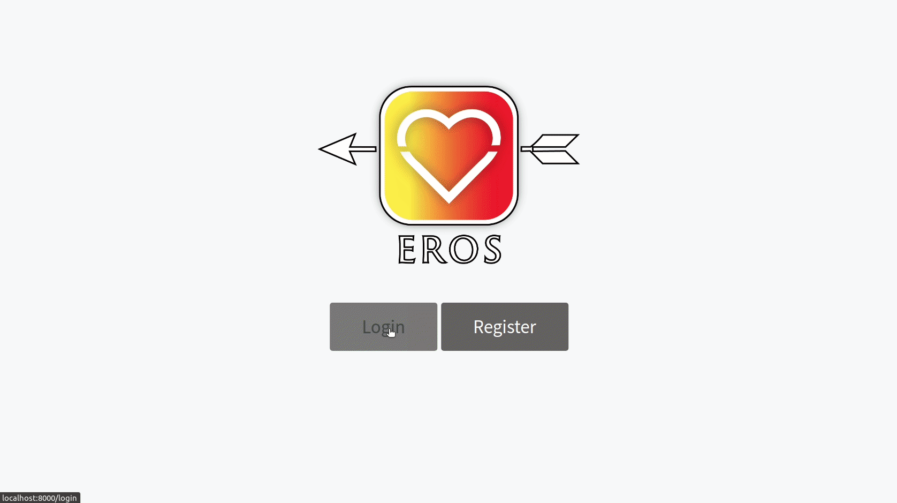

# Dating site

### Features
Create your own personal profile with basic info of yourself and multiple pictures.
View other people within the selected age and gender ranges and choose to like or pass on them. If a match is made you can view your matches full profile and recieve an email that informs you of ur match.
### Setup instructions
Create a new database. Within the directory, rename .env.example to .env and fill out information regarding database and mailing.
Run the following commands:
```
composer install
php artisan key:generate
php artisan storage:link
php artisan migrate
```
If you wish to generate users you can use `php artisan db:seed` to generate 100 users by default.

After all of that is done you can run the server using `php artisan serve` and `php artisan queue:listen`
